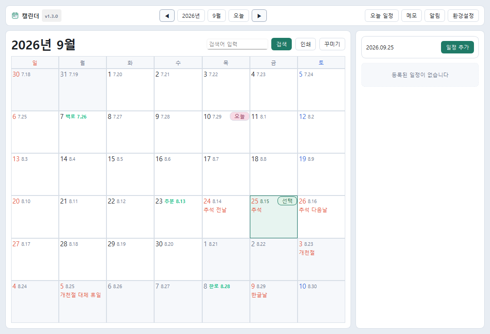
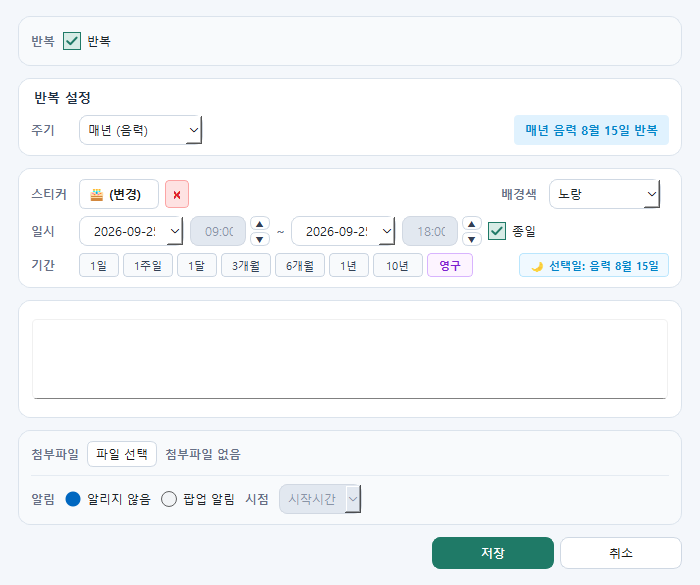

# TaskCalendar v1.5.0 (2026-09-11)

TaskCalendar는 Windows 데스크톱에서 사용하는 개인 일정/메모 관리 앱입니다.  
**🧮 민원 처리기한 모의계산기**, **음력 및 24절기 자동 표기**, **음력 매년 반복 일정(생일/제사)**, **다채로운 일정 꾸미기 스티커/아이콘**, **환경설정 메모 탭(랜덤/지정 색상, 첨부바 On/Off 등)**, 스마트 플로팅 메모(바탕화면 자동 복원), 첨부파일(폴더 열기 지원), 사전 알람, 전역 단축키, 로컬 데이터 암호화 저장을 지원합니다.

---

## 📸 주요 화면 미리보기

| 01. 음력 및 24절기 캘린더 화면 | 02. 민원 처리기한 모의계산기 |
| :---: | :---: |
|  |  |

| 03. 일정 등록 (음력 반복 & 스티커) | 04. 다채로운 스티커 & 아이콘 피커 |
| :---: | :---: |
|  |  |

📖 **[👉 사내 임직원 업무 활용 가이드 상세 보기 (docs/TaskCalendar_업무활용가이드.md)](docs/TaskCalendar_업무활용가이드.md)**

---

## 💾 다운로드 (실행 프로그램)

* 🚀 **[Calendar_v1.5.0_20260911.zip 다운로드 (최신 버전)](https://github.com/wookoon2024/TaskCalendar/raw/main/Calendar_v1.5.0_20260911.zip)**
  * 다운로드 후 압축을 풀고 `Calendar.exe` 파일을 실행하면 별도 설치 없이 즉시 사용할 수 있습니다.

---

## ✨ 주요 기능

* **📝 환경설정 메모 탭 및 메모 기본 설정 [v1.5.0 신규]**:
  * **새 메모 기본 색상**: 🎲 무작위(랜덤) 생성 또는 선호하는 1개 고정 색상(노랑, 초록, 핑크, 보라, 파랑 등) 지정
  * **하단 파일 첨부 및 이미지 바 기본 표시 여부**: On/Off 토글 지원 (Off 상태라도 파일 첨부 시 자동 노출 및 우클릭 메뉴로 열고 닫기 가능)
  * **새 메모 기본 속성**: 항상 위에 고정(Topmost), 기본 투명도, 기본 크기(보통/작게/크게/와이드), 본문 기본 글자 크기 지정
* **📂 그룹 목록형 메모 카드 모서리 및 날짜 보호 [v1.5.0 신규]**:
  * 창 너비가 좁아지거나 내용이 길어져도 카드가 창 밖으로 삐져나가지 않도록 자동 탄력 축약(`ElidedLabel`)
  * 우측 둥근 모서리와 등록 날짜가 어떤 창 너비에서도 100% 온전하게 노출
* **🔒 데이터 안전성 및 환경설정 백업/복구 강화 [v1.5.0 신규]**:
  * 머신 레벨 DPAPI 적용으로 Windows 계정 비밀번호 변경 시에도 DB 복호화 유지
  * 일일 자동 백업 시 동반 설정 JSON(`settings.json`) 자동 생성 및 복원 시 전역 환경설정 즉각 리로드
  * 프로그램 재시작 시 모든 메모 및 그룹 창의 위치, 크기, 접힘 상태 100% 영구 복원
* **🎨 모던 셰브런 탭 버튼 및 SVG 벡터 아이콘 전면 개편 [v1.5.0 신규]**:
  * 상단바 접기/펼치기 및 사이드바 여닫기 슬림 탭 버튼(`[ ◂ 사이드바 표시 ]`, `[ ⌵ 상단바 표시 ]`) 통일감 있게 정렬
  * 그룹 창 및 메모 버튼군 모던 SVG 아이콘 일원화

* **🧮 민원 처리기한 모의계산기 [v1.4.0 신규]**:
  * 상단 툴바의 **`[민원계산기]`** 버튼으로 언제든지 즉시 모의계산 가능
  * **공공 표준 (법정 기준)**: 주말(토/일) 및 법정공휴일 자동 제외, 근무시간(09:00~18:00) 기준 정확한 만료 일시 산정
  * **단순 24시간 연속 계산**: 업무시간 및 휴일 상관없이 단순 시간/일수 누적 계산
  * 프리셋: `[3시간(즉시)]`, `[1일]`, `[2일]`, `[3일]`, `[5일]`, `[7일]`, `[10일]`, `[14일]`, `[30일]` 원클릭 지원
  * **`[📅 이 기한으로 일정 등록]`** 원클릭 시 계산된 일시로 일정 등록 자동 연계

* **🌙 음력 & 24절기 자동 표기 [신규]**:
  * 캘린더 날짜 셀에 **은은한 음력 일자(예: 7.29, 8.15)** 상시 표기
  * 입춘, 춘분, 하지, 백로, 추분, 동지 등 **24절기 당일 산뜻한 녹색 강조 명칭 표기**
  * 환경설정에서 음력/24절기 표시 On/Off 자유롭게 설정 가능
* **🎂 음력 기준 매년 반복 일정 (생일/제사/차례) & 빠른 기간 설정 [신규]**:
  * 일정 등록 시 **[반복] ➔ [매년 (음력)]** 선택 시 선택일의 음력 날짜가 자동 표기되고 매년 정확한 양력 일자에 일정 자동 전개
  * 일시 아래 **[1일] [1주일] [1달] [3개월] [6개월] [1년] [10년] [영구]** 빠른 기간 버튼으로 종료일 1초 만에 자동 완성
* **🎨 다채로운 일정 꾸미기 스티커 & 아이콘 [신규]**:
  * `[스티커...]` 버튼 클릭 시 업무/일정, 기념일/가족, 일상/생활, 강조/스티커 4개 카테고리별 비주얼 피커 제공
  * 등록된 스티커 아이콘이 캘린더 칩과 알림에 선명하게 노출
* **스마트 플로팅 메모**:
  * 프로그램 재시작 시 위치·크기·접힘 상태 100% 자동 복원
  * 캡처 이미지(사내 비상 연락망 등) 복사/붙여넣기 본문 삽입
  * 파일 드래그 앤 드롭 자동 첨부 및 **[파일 열기 / 파일 폴더 열기]** 지원
  * 메모 삭제 시 첨부파일 안전 동반 정리
  * 상단 바 접기/펼치기 (`-` / `+` 동적 아이콘 전환)
  * 항상 위 고정(📌) 및 투명도 조절
  * X 버튼 클릭 시 0ms 즉시 닫힘 최적화
* **일정/할일 관리**: 간소화된 넓은 직접 입력창, 반복 일정(매일/매주/매월/매년 양력 및 음력), 종일 설정
* **사전 알람 & 알림 관리자**: 일정 시작 전(5분, 10분, 15분, 30분, 1시간 전) 사전 팝업 알람 및 다시 알림(5분 뒤)
* **환경설정 & 전역 단축키**: 부팅 시 자동 실행, 캘린더 단축키(`Ctrl+Shift+C`), 빠른 메모 단축키(`Ctrl+Shift+M`), 테마 스킨, 자동 백업
* **보안 및 암호화**: SQLite 바이트 데이터를 Windows DPAPI로 안전하게 암호화 저장

---

## 실행 방법

### 소스코드 실행
```powershell
python main.py
```

### 실행 프로그램 (.exe) 직접 빌드
PyInstaller를 사용하여 단일 실행 파일을 빌드할 수 있습니다:
```powershell
python -m PyInstaller --noconfirm --clean --onefile --windowed --name Calendar --specpath . `
  --icon "taskcalendar/assets/app_icon.ico" `
  --add-data "taskcalendar/assets;taskcalendar/assets" `
  --add-data "data/holidays_kr.json;data" `
  .\main.py
```
