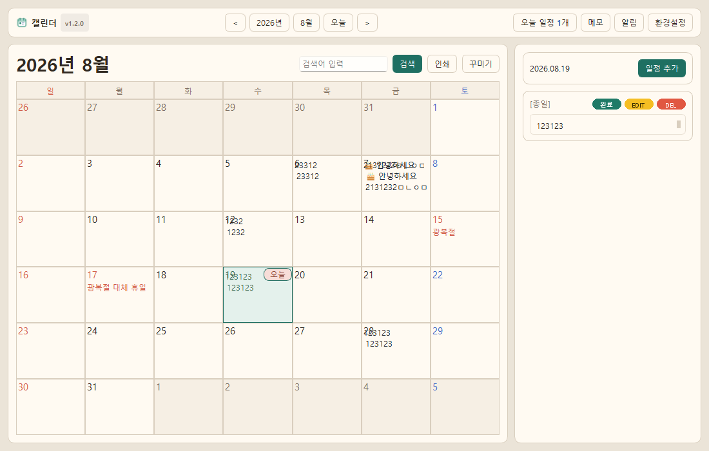
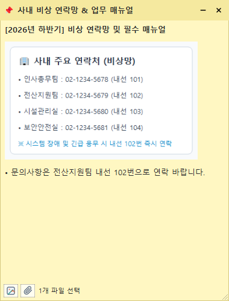
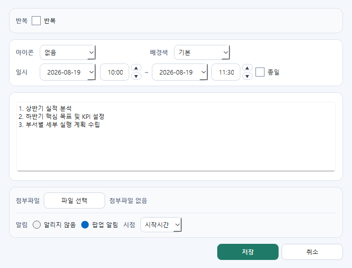
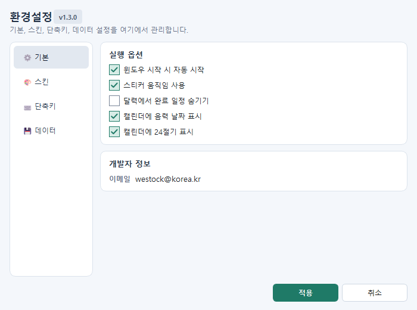

# TaskCalendar v1.2.0 (2026-08-19)

TaskCalendar는 Windows 데스크톱에서 사용하는 개인 일정/메모 관리 앱입니다.  
일정 반복, 첨부파일(폴더 열기 지원), 사전 알람, 스마트 플로팅 메모(바탕화면 포스트잇 자동 복원), 전역 단축키, 테마, 로컬 데이터 암호화 저장을 지원합니다.

---

## 📸 주요 화면 미리보기

| 01. 메인 캘린더 화면 | 02. 스마트 플로팅 메모 (전화번호부/첨부파일) |
| :---: | :---: |
|  |  |

| 03. 일정 등록 (직접 입력 & 사전 알람) | 04. 환경설정 및 전역 단축키 |
| :---: | :---: |
|  |  |

📖 **[👉 사내 임직원 업무 활용 가이드 상세 보기 (docs/TaskCalendar_업무활용가이드.md)](docs/TaskCalendar_업무활용가이드.md)**

---

## 💾 다운로드 (실행 프로그램)

* 🚀 **[Calendar_v1.2.0_20260819.zip 다운로드 (최신 버전)](https://github.com/wookoon2024/TaskCalendar/raw/main/Calendar_v1.2.0_20260819.zip)**
  * 다운로드 후 압축을 풀고 `Calendar.exe` 파일을 실행하면 별도 설치 없이 즉시 사용할 수 있습니다.

---

## ✨ 주요 기능

* **메인 캘린더**: 날짜 셀 빈 공간 더블클릭으로 즉시 일정 추가, 마우스 휠 월 이동, `v1.2.0` 헤더
* **스마트 플로팅 메모**:
  * 프로그램 재시작 시 위치·크기·접힘 상태 100% 자동 복원
  * 캡처 이미지(사내 비상 연락망 등) 복사/붙여넣기 본문 삽입
  * 파일 드래그 앤 드롭 자동 첨부 및 **[파일 열기 / 파일 폴더 열기]** 지원
  * 메모 삭제 시 첨부파일 안전 동반 정리
  * 상단 바 접기/펼치기 (`-` / `+` 동적 아이콘 전환)
  * 항상 위 고정(📌) 및 투명도 조절
  * X 버튼 클릭 시 0ms 즉시 닫힘 최적화
* **일정/할일 관리**: 간소화된 넓은 직접 입력창, 반복 일정(매일/매주/매월/매년), 종일 설정
* **사전 알람 & 알림 관리자**: 일정 시작 전(5분, 10분, 15분, 30분, 1시간 전) 사전 팝업 알람 및 다시 알림(5분 뒤)
* **환경설정 & 전역 단축키**: 부팅 시 자동 실행, 캘린더 단축키(`Ctrl+Shift+C`), 빠른 메모 단축키(`Ctrl+Shift+M`), 테마 스킨, 자동 백업
* **보안 및 암호화**: SQLite 바이트 데이터를 Windows DPAPI로 안전하게 암호화 저장

---

## 실행 방법

### 소스코드 실행
```powershell
python main.py
```

### 실행 프로그램 (.exe) 직접 빌드
PyInstaller를 사용하여 단일 실행 파일을 빌드할 수 있습니다:
```powershell
python -m PyInstaller --noconfirm --clean --onefile --windowed --name Calendar --specpath . `
  --icon "taskcalendar/assets/app_icon.ico" `
  --add-data "taskcalendar/assets;taskcalendar/assets" `
  --add-data "data/holidays_kr.json;data" `
  .\main.py
```
