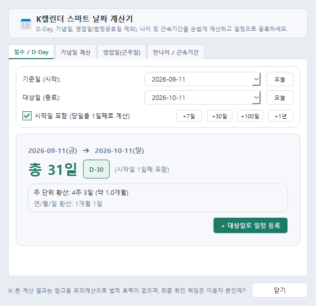

# K캘린더 (TaskCalendar) v1.6.0 (2026-09-11)

**K캘린더**는 Windows 데스크톱 환경에서 공무 및 업무 효율을 극대화하는 스마트 개인 일정·메모 관리 솔루션입니다.  
새롭게 추가된 **스마트 날짜 계산기(D-Day, 기념일, 법정공휴일 제외 영업일/근무일 산정, 나이/근속기간)**, **일정 등록 원클릭 연동**, **음력 및 24절기 자동 표기**, **음력 매년 반복 일정(생일/제사)**, **다채로운 일정 스티커/아이콘**, **우측 기준 스마트 확장 및 화면 밖 넘침 방지**, 스마트 플로팅 메모(바탕화면 자동 복원), 첨부파일(폴더 열기 지원), 사전 알람, 전역 단축키, 무손실 로컬 데이터 암호화 저장을 지원합니다.

---

## 📸 주요 화면 미리보기

| 01. 음력 및 24절기 캘린더 화면 | 02. 일정 등록 (음력 반복 & 스티커) |
| :---: | :---: |
|  |  |

| 03. 다채로운 스티커 & 아이콘 피커 | 04. 스마트 플로팅 메모 |
| :---: | :---: |
|  |  |

| 05. 스마트 날짜 계산기 (D-Day·영업일) | 06. 플로팅 메모 그룹 관리 |
| :---: | :---: |
|  |  |

📖 **[👉 사내 임직원 업무 활용 가이드 상세 보기 (docs/TaskCalendar_업무활용가이드.md)](docs/TaskCalendar_업무활용가이드.md)**

---

## 💾 다운로드 (실행 프로그램)

* 🚀 **[Calendar_v1.6.0_20260911.zip 다운로드 (최신 버전)](https://github.com/wookoon2024/TaskCalendar/raw/main/Calendar_v1.6.0_20260911.zip)**
  * 다운로드 후 압축을 풀고 `Calendar.exe` 파일을 실행하면 별도 설치 없이 즉시 사용할 수 있습니다.

---

## ✨ 주요 기능

* **📅 스마트 다기능 날짜 계산기 & 일정 등록 연계 [v1.6.0 신규]**:
  * **상단바 전용 버튼**: 상단바 알람 버튼 우측에 `[날짜계산기]` 원클릭 진입 툴바 제공
  * **탭 1. 일수 / D-Day 계산**:
    * 기준일과 대상일 간격 계산 (시작일 당일 1일째 포함 옵션 제공)
    * D-Day 배지(`D-Day`, `D-10`, `D+15` 등), 총 일수, 주/일 환산(`N주 M일`), 연/월/일 분할 상세 표기
    * `[+ 대상일로 일정 등록]` 원클릭 시 캘린더 일정 등록창으로 자동 연계
  * **탭 2. 기념일 계산**:
    * 100일, 200일, 300일, 500일, 1000일 및 1~10주년 자동 산정 테이블
    * 계산된 각 기념일의 정확한 요일 및 **음력 날짜** 병기
    * N일/주/개월/년 전·후 커스텀 날짜 계산기 내장 및 항목별 `[+ 등록]` 버튼 제공
  * **탭 3. 영업일(근무일) 계산 (법정 공휴일 및 주말 자동 제외)**:
    * 대한민국 법정공휴일/대체공휴일 및 주말(토/일)을 자동 판별·제외하는 정밀 엔진
    * `기간 내 영업일수 산출`: 기간 내 주말 일수, 제외된 공휴일 상세 목록, 순수 영업일수 계산
    * `N영업일 후 마감일 계산`: 기준일로부터 N영업일 후 최종 마감 일자 및 제외된 휴일 정보 산출
    * `[+ 마감/영업일정 등록]` 원클릭 캘린더 등록 연계
  * **탭 4. 만 나이 / 근속기간 계산**:
    * 생년월일 기준 **만 나이(생일 경과 여부 반영)**, **연 나이**, **띠 및 육십갑자(간지)** 자동 산정
    * 다가오는 다음 생일까지 D-Day 계산 및 `[+ 생일 일정 등록]`
    * 입사일 기준 현재(또는 퇴사일)까지의 총 근속기간(N년 M개월 D일) 및 총 재직일수 산정, `[+ 기념일 일정 등록]`
* **🏷️ 공식 브랜드 명칭 "K캘린더" 반영 [v1.6.0]**:
  * 메인 윈도우 제목, 트레이 아이콘 툴팁, 기능 안내 다이얼로그 전반에 "K캘린더" 명칭 적용
* **📐 우측 기준 스마트 확장 & 화면 밖 넘침 방지 및 상단바 제어 [v1.5.3]**:
  * **우측 화면 밖 넘침 방지 & 스마트 확장**: 환경설정의 `[메모/그룹 펼칠 때 우측 기준으로 확장]` 옵션 활성화 시, 화면 중앙에서는 왼쪽 기준(우측 확장)을 유지하고 화면 우측 끝에 밀착되어 있을 때만 우측 모서리를 고정한 채 왼쪽으로 안전하게 확장
  * **접힘 시 우측 밀착 위치 완벽 복귀**: 우측 끝에 붙은 상태에서 메모/그룹을 펼쳤다가 다시 접을 때, 좌측 기준으로 닫혀 우측 밀착이 풀리던 문제를 완벽 해결하고 우측 가장자리에 밀착된 원래 위치로 정확히 복귀
  * **환경설정 즉시 전역 연동**: 설정 변경 시 앱 재시작 없이 현재 열려 있는 모든 메모 및 그룹 창에 우측 기준 모드 즉각 실시간 반영
  * **상단바 윈도우 제어(투명도/핀) 표시 옵션**: 환경설정 일반 탭에서 상단바의 투명도 조절 슬라이더 및 항상 위 고정(핀) 버튼 표시 여부 On/Off 토글 지원
* **📐 메모 접기/펼치기 크기 독립 유지 & 테두리 더블클릭 확장 [v1.5.2]**:
  * **접힘/펼침 가로 크기 각각 독립 저장**: 내용이 길 때 펼쳐진 상태의 크기와 접힌 상태에서 콤팩트하게 줄인 가로 크기를 각각 독립 기억/복원
  * **우측 테두리 더블클릭 스마트 확장/복귀**: 접힌 상태에서 우측 테두리(↔ 커서)를 더블클릭하면 열렸을 때의 가로 너비로 즉시 자동 확장 (재클릭 시 콤팩트 크기 복귀)
  * **메모 좌측 사이드 크기 조절**: 우측뿐만 아니라 좌측 테두리 드래그로도 자유롭게 너비 조절 지원
  * **새 그룹 메모 한 줄 목록 기본화**: 새 그룹 생성 시 한 줄 목록(`list`) 뷰 기본 적용
  * **팝업 창 WindowModal 전환**: 일정 등록창, 환경설정창 등이 열려 있어도 바탕화면 메모를 자유롭게 이동/조작 가능
  * **상단바/사이드바 토글 버튼 순서 최적화**: `[상단바 표시]` `[사이드바 표시]` 순서 배치
* **📁 스마트 플로팅 메모 그룹 관리 (프로젝트·업무별 폴더화)**:
  * **바탕화면 폴더형 그룹 창**: 여러 개의 메모를 프로젝트나 업무 주제별로 하나의 폴더형 창에 묶어 바탕화면에 깔끔하게 띄워두고 체계적으로 관리
  * **보기 모드 전환 (한 줄 목록형 ↔ 카드형)**: 상단 뷰 아이콘 클릭 시 심플한 한 줄 목록(`list`) 뷰와 카드형(`card`) 뷰를 원클릭으로 손쉽게 전환
  * **그룹 내 메모 일괄 열기 / 닫기**: 그룹 내 모든 메모를 바탕화면에 한 번에 펼치거나 닫을 수 있어 멀티태스킹 작업 전환 최적화
  * **메모 ↔ 그룹 상호 자석 스냅**: 그룹 창과 일반 메모 창 간의 양방향 1px 정밀 자석 스냅(밀착) 효과로 깔끔하고 정돈된 화면 배치
  * **상단바 여백 더블클릭 콤팩트 접기/펼치기**: 상단바 여백, 아이콘 더블클릭 시 36px 슬림 타이틀바로 신속히 접혀 작업 공간 극대화
  * **제목 더블클릭 전용 인라인 편집**: 일반 메모와 동일하게 제목 텍스트를 더블클릭할 때만 편집 모드로 전환되어 평상시 오입력 방지
  * **우측 기준 스마트 확장 및 테두리 더블클릭 확장**: 화면 우측 끝에 밀착 시 창 넘침 없이 안전하게 확장되고 원래 위치로 완벽 복귀
* **🛡️ Windows 계정 변경 무손실 백업/복원 및 엑셀 설정 백업 [v1.5.1 신규]**:
  * **윈도우 계정 독립형 복구**: ZIP 백업에 기기 독립형 SQLite 데이터(`taskcalendar.db`)를 포함하여 다른 윈도우 계정/새 PC에서도 DPAPI 복호화 오류 없이 100% 원클릭 복원
  * **자동 백업 안전망**: 자동 백업 시 `.sqlite.bak` 스냅샷 동시 생성으로 윈도우 계정이 변경되어도 앱 시작 시 무손실 자동 복구
  * **엑셀(XLSX) 환경설정 백업/복원**: 엑셀 내보내기 시 `settings` 시트를 생성하여 테마, 단축키, 메모 옵션 등 모든 설정을 함께 백업하고 복원 지원
  * **복원 즉시 전역 설정 반영**: 백업 복원 시 환경설정 덮어쓰기 버그 수정 및 테마 스타일시트/단축키/스티커 즉시 실시간 갱신
  * **사이드바 메모 제목만 표시 연동**: 사이드바 메모 콤팩트 1줄 목록 표시 설정값 실제 연동 버그 수정
* **📝 환경설정 메모 탭 및 메모 기본 설정 [v1.5.0]**:
  * **새 메모 기본 색상**: 🎲 무작위(랜덤) 생성 또는 선호하는 1개 고정 색상(노랑, 초록, 핑크, 보라, 파랑 등) 지정
  * **하단 파일 첨부 및 이미지 바 기본 표시 여부**: On/Off 토글 지원 (Off 상태라도 파일 첨부 시 자동 노출 및 우클릭 메뉴로 열고 닫기 가능)
  * **새 메모 기본 속성**: 항상 위에 고정(Topmost), 기본 투명도, 기본 크기(보통/작게/크게/와이드), 본문 기본 글자 크기 지정
* **📂 그룹 목록형 메모 카드 모서리 및 날짜 보호 [v1.5.0]**:
  * 창 너비가 좁아지거나 내용이 길어져도 카드가 창 밖으로 삐져나가지 않도록 자동 탄력 축약(`ElidedLabel`)
  * 우측 둥근 모서리와 등록 날짜가 어떤 창 너비에서도 100% 온전하게 노출
* **🎨 모던 셰브런 탭 버튼 및 SVG 벡터 아이콘 전면 개편 [v1.5.0]**:
  * 상단바 접기/펼치기 및 사이드바 여닫기 슬림 탭 버튼(`[ ◂ 사이드바 표시 ]`, `[ ⌵ 상단바 표시 ]`) 통일감 있게 정렬
  * 그룹 창 및 메모 버튼군 모던 SVG 아이콘 일원화

* **🧮 민원 처리기한 모의계산기 [v1.4.0 신규]**:
  * 상단 툴바의 **`[민원계산기]`** 버튼으로 언제든지 즉시 모의계산 가능
  * **공공 표준 (법정 기준)**: 주말(토/일) 및 법정공휴일 자동 제외, 근무시간(09:00~18:00) 기준 정확한 만료 일시 산정
  * **단순 24시간 연속 계산**: 업무시간 및 휴일 상관없이 단순 시간/일수 누적 계산
  * 프리셋: `[3시간(즉시)]`, `[1일]`, `[2일]`, `[3일]`, `[5일]`, `[7일]`, `[10일]`, `[14일]`, `[30일]` 원클릭 지원
  * **`[📅 이 기한으로 일정 등록]`** 원클릭 시 계산된 일시로 일정 등록 자동 연계

* **🌙 음력 & 24절기 자동 표기 [신규]**:
  * 캘린더 날짜 셀에 **은은한 음력 일자(예: 7.29, 8.15)** 상시 표기
  * 입춘, 춘분, 하지, 백로, 추분, 동지 등 **24절기 당일 산뜻한 녹색 강조 명칭 표기**
  * 환경설정에서 음력/24절기 표시 On/Off 자유롭게 설정 가능
* **🎂 음력 기준 매년 반복 일정 (생일/제사/차례) & 빠른 기간 설정 [신규]**:
  * 일정 등록 시 **[반복] ➔ [매년 (음력)]** 선택 시 선택일의 음력 날짜가 자동 표기되고 매년 정확한 양력 일자에 일정 자동 전개
  * 일시 아래 **[1일] [1주일] [1달] [3개월] [6개월] [1년] [10년] [영구]** 빠른 기간 버튼으로 종료일 1초 만에 자동 완성
* **🎨 다채로운 일정 꾸미기 스티커 & 아이콘 [신규]**:
  * `[스티커...]` 버튼 클릭 시 업무/일정, 기념일/가족, 일상/생활, 강조/스티커 4개 카테고리별 비주얼 피커 제공
  * 등록된 스티커 아이콘이 캘린더 칩과 알림에 선명하게 노출
* **스마트 플로팅 메모**:
  * 프로그램 재시작 시 위치·크기·접힘 상태 100% 자동 복원
  * 캡처 이미지(사내 비상 연락망 등) 복사/붙여넣기 본문 삽입
  * 파일 드래그 앤 드롭 자동 첨부 및 **[파일 열기 / 파일 폴더 열기]** 지원
  * 메모 삭제 시 첨부파일 안전 동반 정리
  * 상단 바 접기/펼치기 (`-` / `+` 동적 아이콘 전환)
  * 항상 위 고정(📌) 및 투명도 조절
  * X 버튼 클릭 시 0ms 즉시 닫힘 최적화
* **일정/할일 관리**: 간소화된 넓은 직접 입력창, 반복 일정(매일/매주/매월/매년 양력 및 음력), 종일 설정
* **사전 알람 & 알림 관리자**: 일정 시작 전(5분, 10분, 15분, 30분, 1시간 전) 사전 팝업 알람 및 다시 알림(5분 뒤)
* **환경설정 & 전역 단축키**: 부팅 시 자동 실행, 캘린더 단축키(`Ctrl+Shift+C`), 빠른 메모 단축키(`Ctrl+Shift+M`), 테마 스킨, 자동 백업
* **보안 및 암호화**: SQLite 바이트 데이터를 Windows DPAPI로 안전하게 암호화 저장

---

## 실행 방법

### 소스코드 실행
```powershell
python main.py
```

### 실행 프로그램 (.exe) 직접 빌드
PyInstaller를 사용하여 단일 실행 파일을 빌드할 수 있습니다:
```powershell
python -m PyInstaller --noconfirm --clean --onefile --windowed --name Calendar --specpath . `
  --icon "taskcalendar/assets/app_icon.ico" `
  --add-data "taskcalendar/assets;taskcalendar/assets" `
  --add-data "data/holidays_kr.json;data" `
  .\main.py
```
