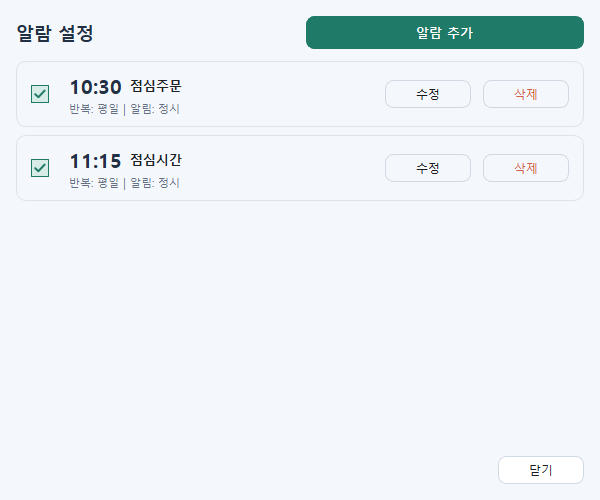
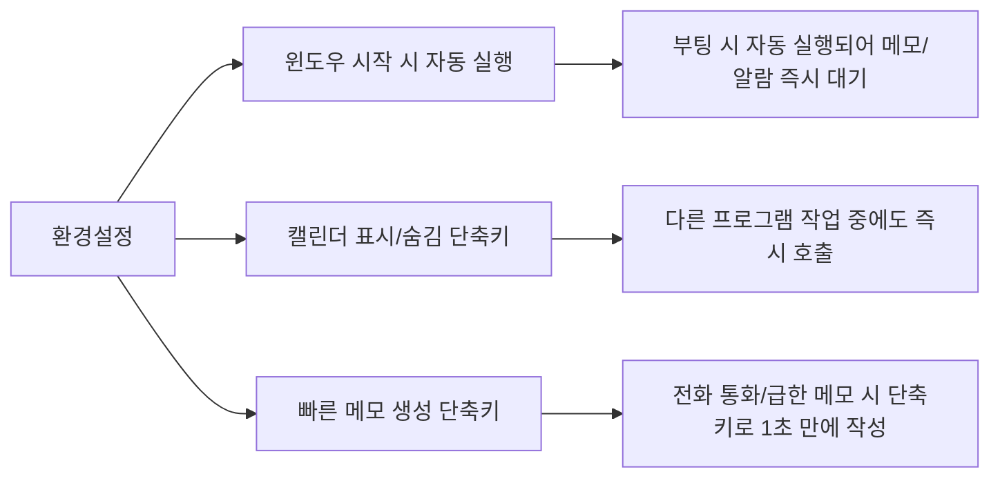

# 📅 TaskCalendar 기능 & 업무 활용 가이드 (v1.2.0 / 2026-08-19)

> **사내 임직원의 업무 효율과 일정 관리를 극대화하기 위한 TaskCalendar 전체 기능(캘린더, 스마트 플로팅 메모, 사전 알람, 전역 단축키) 안내서입니다.**

---

## 📸 전체 기능 화면 미리보기

---

## 📌 1. 메인 캘린더 화면

* **캘린더 빈 곳 더블 클릭**: 날짜 셀의 빈 공간을 더블 클릭하면 해당 날짜로 **[일정 등록] 창이 즉시 열립니다.**
* **상단 헤더 정보**: 최신 버전(`v1.2.0`) 확인 및 `< 2026년 8월 오늘 >` 버튼으로 연/월을 손쉽게 이동할 수 있습니다.
* **마우스 휠 월 이동**: 캘린더 영역에서 마우스 휠을 위/아래로 굴리면 이전 달 / 다음 달로 부드럽게 전환됩니다.
* **사이드바 통합 관리**: 우측 사이드바에서 오늘 일정, 선택일 일정, 메모 목록을 직관적으로 확인하고 정렬할 수 있습니다.

---

## 📝 2. 스마트 플로팅 메모 (바탕화면 포스트잇 & 업무 자료)

| 주요 기능 | 설명 및 업무 활용 팁 |
| :--- | :--- |
| **바탕화면 위치 & 크기 자동 기억** | 메모를 원하는 곳에 배치해 두면 **프로그램 종료 후 재시작 시 그 위치·크기·접힘 상태 그대로 100% 자동 복원**됩니다. |
| **전화번호부 / 이미지 본문 삽입** | 캡처 도구(`Win + Shift + S`)로 **사내 연락망, 업무 매뉴얼, 비상 연락처 등을 복사(Ctrl+C) 후 메모에 붙여넣기(Ctrl+V)**하면 본문에 선명하게 들어갑니다. |
| **파일 드래그 앤 드롭 자동 첨부** | 탐색기에서 파일을 메모 창으로 **끌어다 놓기(Drag & Drop)**만 하면 파일이 즉시 자동 첨부됩니다. |
| **[신규] 파일 열기 & 파일 폴더 열기** | • **파일 열기** : 첨부파일을 기본 연결 프로그램(엑셀, PDF, 이미지 뷰어 등)으로 바로 실행합니다. • **파일 폴더 열기** : 윈도우 탐색기를 열어 **해당 파일이 있는 폴더로 이동 후 파일을 자동 하이라이트**해 줍니다. |
| **메모 삭제 시 파일 자동 정리** | 메모를 삭제하면 연결된 첨부파일도 디스크에서 **안전하게 동반 삭제**되어 용량을 낭비하지 않습니다. |
| **상태 전환 버튼 (`-` / `+`)** | 상단 `-` 버튼을 누르면 제목만 남기고 상단 바(34px)로 깔끔하게 접히며(`+`로 변경), `+`를 누르면 원래 크기로 즉시 복원됩니다. |
| **항상 위 고정(📌) & 투명도 조절** | 핀(📌)을 눌러 다른 작업 창보다 항상 위에 띄우거나, 슬라이더로 투명도를 조절해 배경 문서를 보면서 작업할 수 있습니다. |
| **즉각 닫기 최적화 (0ms)** | `X` 버튼을 누르면 지연 없이 **누르는 즉시 번개처럼 빠르게 닫히며** 안전하게 자동 저장됩니다. |

---

## ✍️ 3. 일정 & 할일 등록

* **간소화된 직접 입력창**: 복잡한 헤더 라벨을 없애고 열자마자 바로 일정 내용을 타이핑할 수 있는 넓은 입력 영역을 제공합니다.
* **반복 일정 지원**: 매일, 매주, 매월 특정 요일/날짜, 매년 등 다양한 반복 패턴을 지원합니다.
* **일시 & 종일 옵션**: 시작/종료 일시 및 시간을 자유롭게 지정하거나 [종일] 체크로 하루 종일 일정을 설정할 수 있습니다.
* **사전 팝업 알람**: 일정 시작 시간 기준 **5분 전, 10분 전, 15분 전, 30분 전, 1시간 전** 사전 알림을 지정할 수 있습니다.

---

## ⚙️ 4. 환경설정 & 전역 단축키

1. **윈도우 시작 시 자동 실행**: PC 부팅 시 백그라운드로 자동 실행되어 플로팅 메모와 사전 알람이 항상 대기합니다.
2. **캘린더 표시/숨김 전역 단축키** (기본: `Ctrl + Shift + C`): 워드, 엑셀, 웹서핑 중 언제 어디서든 단축키로 캘린더를 호출하고 숨길 수 있습니다.
3. **빠른 메모 전역 단축키** (기본: `Ctrl + Shift + M`): 전화 통화나 긴급 메모가 필요할 때 1초 만에 새 메모 창을 띄울 수 있습니다.
4. **테마 스킨 & 자동 백업**: 밝은/어두운 테마 스킨 변경 및 소중한 데이터 자동 암호화 백업 설정을 관리합니다.

---

## ⏰ 5. 알림 관리자 (사전 알람 & 반복 알림)

* **전체 알람 현황 조회**: 등록된 모든 사전 알람과 독립 알람 목록을 한눈에 조회하고 수정/삭제할 수 있습니다.
* **정각/지정 알림**: 출퇴근 시간, 약 복용, 정기 회의 등 원하는 시간대별 커스텀 알람을 손쉽게 추가합니다.

---

> [!TIP]
> **💡 임직원 추천 업무 꿀팁**:
> 1. 자주 확인하는 **"사내 비상 연락망"**이나 **"프로젝트 일정표"**를 메모에 띄워두고 **[항상 위 고정(📌)]** 해두세요!
> 2. 자리를 비우거나 화면을 넓게 써야 할 때는 **메모 상단 `-` 버튼을 눌러 슬림하게 접어두세요!**
