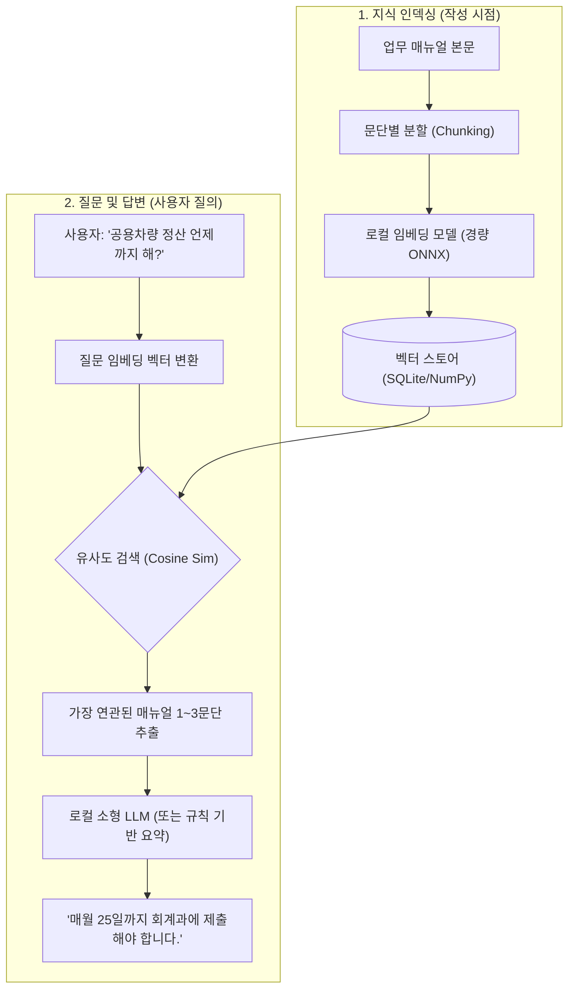

# 📋 TaskCalendar 업무 관리 및 인수인계 지식 편람(Knowledge Hub) 상세 기획서

---

## Ⅰ. 추진 배경 및 핵심 개념

### 1.1 기획 배경 및 문제 의식
* **공공기관 인수인계의 현실**: 잦은 순환보직(1~2년 주기)으로 인해 인수인계가 부실하여 업무 공백과 감사 지적 사례 빈번.
* **개념의 혼선 해결**: 현재 TaskCalendar에 저장되는 온나라 결재문서·공문 데이터는 **'문서(이력)'**이며, 실무자가 1년 내내 챙겨야 하는 **'진짜 단위업무(매뉴얼/지식)'**와 분리할 필요가 있음.
* **자연스러운 지식 자산화**: 평소 일하면서 단위업무별로 절차와 팁을 기록해두면, 인사철에 버튼 한 번으로 완성형 **인수인계서(HWPX/PDF 책자)**로 자동 출력.

### 1.2 시스템 개념 재정립 (Data Taxonomy)

```
┌────────────────────────────────────────────────────────────────────────┐
│                             바로업무 통합 데이터 구조                             │
├───────────────┬────────────────────────────────────────────────────────┤
│ 1. [일정]      │ 특정 일자/시간에 수행하는 이벤트 (회의, 출장, 행사)      │
├───────────────┼────────────────────────────────────────────────────────┤
│ 2. [문서] (기존)│ 온나라 결재문서, 기안문, 공문서 수집 이력                │
│               │ (제목, 부서, 기안자, 날짜, 결재상태, 비고 등)           │
├───────────────┼────────────────────────────────────────────────────────┤
│ 3. [업무] (신규)│ 실무자가 담당하는 '단위업무' 및 '업무편람/인수인계'     │
│  ★ 이번 핵심  │ • 업무 분류, 주기, 기한, 법적근거                      │
│               │ • 리치 에디터 본문 (표, 이미지, 절차도, 배지)          │
│               │ • 관련 서식/첨부파일 보관                              │
│               │ • 관련 [문서] 연결 & HWPX/PDF 책자 내보내기            │
├───────────────┼────────────────────────────────────────────────────────┤
│ 4. [메모]      │ 바탕화면 퀵 메모 및 포스트잇                           │
└───────────────┴────────────────────────────────────────────────────────┘
```

---

## Ⅱ. 화면 구조 및 UI/UX 상세 설계

### 2.1 메인 레이아웃 (좌우 2분할 뷰)

```
+------------------------------------------------------------------------------------------------------------------+
| 💼 업무 관리 및 인수인계 편람                              [템플릿 서식]  [📁 HWPX 내보내기]  [📄 PDF]  [💾 저장] |
+-----------------------------------+------------------------------------------------------------------------------+
| [업무 분류 트리]     [+ 새 업무 등록] | 📌 업무명: [ 2026년 공용차량 운용 및 관리 매뉴얼                         ] |
| ───────────────────────────────── | ──────────────────────────────────────────────────────────────────────────── |
| 📁 1. 부서 총괄 및 서무            | 🏷️ 업무분류: [서무/총괄 ▼]   📅 주기: [매월/반기 ▼]   🚨 중요도: [상 (필수) ▼]    |
|   ├ 📄 공용차량 운용 관리 (★선택)  | 👤 담당자: [홍길동 (주무관)]  👥 협조자: [김철수 (계장)]   ⏰ 마감시기: [매월 25일] |
|   ├ 📄 청사 보안 및 비표 관리      | ⚖️ 법적근거: [공용차량 관리규정 (대통령령), 부서 일상경비 집행지침]           |
|   └ 📄 부서 소모품 구매 및 지출   +------------------------------------------------------------------------------+
| 📁 2. 예산 및 회계 관리            | [에디터 툴바] B I U 취소선 | F색상 T배경 | 크기▼ | 📊표삽입 | 🖼️이미지 | 💡배지▼ |
|   ├ 📄 상반기 전산장비 구입        | ---------------------------------------------------------------------------- |
|   └ 📄 유지보수 용역 기성 검사     | 1. 업무 개요 및 목적                                                         |
| 📁 3. 고유 사업                    |   본 업무는 부서 소관 공용차량의 배차, 정비, 유류대 정산을...                 |
|   ├ 📄 정보화사업 제안서 평가      |                                                                              |
|   └ 📄 위탁용역 최종 준공          | 2. 처리 절차 (Step-by-Step)                                                  |
|                                   |   [Step 1. 배차신청] ➡️ [Step 2. 운행일지 결재] ➡️ [Step 3. 유류대 정산]      |
|                                   |                                                                              |
|                                   | 3. 전임자 실무 팁 및 감사 주의사항                                           |
|                                   |   🚨 [필수확인] 매월 25일까지 회계과에 정산공문 미제출 시 다음 달 배차 제한! |
|                                   |   ⚠️ [감사주의] 주말 및 공휴일 운행 시 반드시 사전 승인 공문 번호 기재할 것 |
|                                   | ---------------------------------------------------------------------------- |
|                                   | 📎 첨부파일 및 표준서식 (드래그앤드롭으로 파일 추가)                         |
|                                   |   • 📊 [차량운행일지_표준서식.xlsx] (18KB)  • 📄 [차량정비_견적서_예시.hwpx] |
+-----------------------------------+------------------------------------------------------------------------------+
```

### 2.2 리치 에디터(Rich Editor) 상세 사양
1. **표(Table) 작성 기능**:
   - `[표 삽입]` 클릭 시 팝업을 통해 행×열 지정 생성
   - 행/열 추가·삭제, 셀 너비 조절, 테두리 및 헤더 행 회색 배경 스타일
2. **이미지/스크린샷 클립보드 붙여넣기 (`Ctrl+V`)**:
   - 업무 시스템(온나라, e호조 등) 캡처 후 본문에서 `Ctrl+V` 누르면 즉시 삽입
   - 마우스 드래그를 통한 이미지 리사이즈 핸들 지원
3. **행정 전용 시각 배지(Asset) 툴바**:
   - 🚨 `[필수확인]`: 기한 마감, 필수 서류 등 누락 시 치명적인 사항 강조
   - ⚠️ `[감사주의]`: 과거 감사 지적 사례 및 예방 요령
   - 💡 `[실무팁]`: 담당자만의 노하우 및 협조 부서 대응 요령
   - 📌 `[관련규정]`: 상위 법령, 훈령, 조례 조항 링크
4. **업무 절차 블록**:
   - 화살표 형태의 진행 단계도 자동 삽입 (`[1단계]` ➡️ `[2단계]` ➡️ `[3단계]`)

### 2.3 표준 서식 템플릿(양식) 라이브러리
빈 페이지에서 작성하는 부담을 덜기 위해 버튼 하나로 기본 골격을 자동 생성:
* **템플릿 A: 단위업무 실무 편람형** (업무개요, 법적근거, 처리절차, 주요서식, Q&A)
* **템플릿 B: 사무인수인계서 표준형 (행안부 규정 양식)** (소관업무 현황, 예산/물품 현황, 진행과제, 미결과제)
* **템플릿 C: 감사대비 체크리스트형** (주기별 필수 점검표, 증빙 구비 여부 체크)
* **템플릿 D: 정기 루틴 업무형** (월별/분기별 정기 공문 기안 스케줄)

---

## Ⅲ. 첨부파일 관리 및 HWPX/PDF 내보내기

### 3.1 첨부파일 보관함 (Asset Vault)
* 각 단위업무마다 관련 서식(xlsx, hwp, hwpx, pdf 등)을 무제한 드래그앤드롭 첨부.
* 데이터베이스 경로 관리 및 전용 로컬 디렉토리(`data/manual_attachments/`)에 안전 보관.
* 더블클릭 시 윈도우 기본 연결 프로그램으로 즉시 실행.

### 3.2 HWPX 공문서 표준 출력 (핵심 기능)
* 오픈포맷인 HWPX(zip 패키지 내 XML 구조)를 파이썬 내장 라이브러리로 직접 빌드.
* **문서 구성**:
  1. **표지**: 기관명, 부서명, 작성일자, 인계자/인수자/입회관 직인 날인란
  2. **목차**: 업무분류별 자동 인덱싱 및 페이지 번호
  3. **총괄표**: 업무 목록 및 연간 주기표
  4. **본문**: 단위업무별 기술서 (표, 이미지, 배지, 첨부파일 목록 포함)
* **PDF 내보내기**: 즉시 인쇄 및 배포가 가능한 고품질 A4 보고서 출력.

---

## Ⅳ. 🔍 RAG (검색 증강 생성) 기능의 실현 가능성 및 구현 방안

> **"RAG 기능도 구현이 가능한가요?"**  
> **👉 결론부터 말씀드리면: 100% 구현 가능하며, 공공기관의 특수성(인터넷 차단망/보안망)에 맞춰 "완전 오프라인 로컬 RAG"로 구축할 수 있습니다.**

### 4.1 RAG 작동 원리 (업무 편람 특화)



### 4.2 단계별 RAG 구현 로드맵

공공기관 환경(인터넷망 vs 행정망/폐쇄망)에 맞춰 2단계로 나누어 구축합니다.

#### [1단계] 초경량 오프라인 시맨틱 검색 (인터넷 전혀 불필요, 0% CPU 부담)
* **원리**:
  - 작성된 업무 매뉴얼을 문단별로 쪼갠 뒤, 초경량 한국어 문장 임베딩(약 30~50MB 크기의 ONNX 경량 모델)으로 숫자 벡터화하여 SQLite에 저장.
  - 사용자가 검색창에 자연어로 질문(예: *"차량 기름값 청구"*)을 넣으면, 키워드가 일치하지 않아도 의미상 동일한 *"공용차량 유류비 정산 절차"* 문단을 **0.05초 만에 정확하게 찾아내어 화면에 하이라이트** 표시.
* **장점**: 외부 통신 0%, 설치 용량 극소, GPU 불필요(일반 공무원 PC CPU에서 즉시 구동).

#### [2단계] 완전 오프라인 로컬 생성형 AI (Generative RAG)
* **원리**:
  - 1단계에서 추출된 문단을 바탕으로, 경량 로컬 LLM(예: 온디바이스 GGUF 포맷의 `EXAONE 3.0 2.4B` 또는 `Qwen2.5 3B` / Ollama)에게 전달.
  - *"매뉴얼에 따르면 매월 25일까지 회계과로 지출결의 공문을 보내야 하며, 필요 서식은 '차량운행일지.xlsx'입니다."*와 같이 **친절한 문장으로 답변을 생성**.
* **선택적 확장**:
  - PC 사양이 높거나 기관 내 인트라넷 AI API(온프레미스 LLM)가 제공되는 경우 API 주소만 입력하여 즉시 연동 가능.

---

## Ⅴ. 개발 단계별 구현 계획

| 단계 | 추진 과제 | 상세 내역 |
| :---: | :--- | :--- |
| **Phase 1** | **업무 관리 DB & 좌우 2분할 뷰** | • `work_manuals`, `work_categories` SQLite 테이블 설계<br>• 좌측 업무 분류 트리 + 우측 기본 폼 UI 구성 |
| **Phase 2** | **리치 에디터 & 공공 에셋/템플릿** | • 표(Table) 삽입/편집 기능 및 클립보드 스크린샷 붙여넣기<br>• 행정 전용 배지(🚨⚠️💡📌) 및 표준 서식 템플릿(4종) 탑재 |
| **Phase 3** | **첨부파일 관리 & HWPX/PDF 내보내기** | • 업무별 드래그앤드롭 첨부파일 보관함<br>• HWPX(한글 공문서 표준) 및 PDF 책자 형태 원클릭 내보내기 |
| **Phase 4** | **통합 검색 & 오프라인 RAG 구축** | • FTS5 키워드 초고속 검색<br>• 로컬 임베딩 기반 오프라인 시맨틱 검색 & 질의응답 엔진 탑재 |
